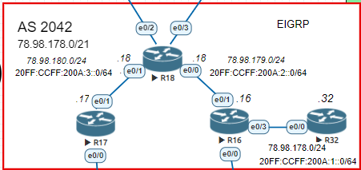

#  EIGRP

###  Задание - Настроить EIGRP в С.-Петербург  используя named EIGRP:

  1. R32 получает только маршрут по-умолчанию;
  2. R16-17 анонсируют только суммарные префиксы;

###  Решение:
  0. [Пролог;](#loh)
  1. [R32 получает только маршрут по-умолчанию;](#1)
  2. [R16-17 анонсируют только суммарные префиксы;](#2)
  3. [Апгрейд в  именованный EIGRP;](#3)

###  Таблица Router-ID

router id для EIGRP будет прописываться исходя из 0.0.0.n, где n номер роутера

| equip |  router-id |
| ------------ | ------------ |
| R16  | 0.0.0.16  |
| R17  | 0.0.0.17   |
| R18  |  0.0.0.18  |
| R32  |  0.0.0.32  |

### Пролог  

  * Сначала  будем настраивать ванильный  EIGRP, после будет апгрейд в  именованный. Фундамент настройки EIGRP на всех роутера будет включать в себя  текущие параметры:
  
  1. Создание  AS IPv4/v6;

            router eigrp 10

            ipv6 router eigrp 10
            no shutdown 
  
  2. Настройка  router ID на каждом роутере;

            eigrp router-id  N
  
  3. Указания  фильтра для сети;

        network  n.n.n.n n.n.n.n WD 

            для  IPv6 на интерфейсе  пишем ipv6 eigrp 10
  
  4. Возьмём один роутер для  проверки установки соседства; 

            spb-R18#show  ip eigrp neighbors
            EIGRP-IPv4 Neighbors for AS(10)
            H   Address                 Interface              Hold Uptime   SRTT   RTO  Q  Seq
                                                              (sec)         (ms)       Cnt Num
            1   78.98.180.17            Et0/1                    12 00:51:12 1601  5000  0  3
            0   78.98.179.16            Et0/0                    10 00:51:21 1022  5000  0  5
            spb-R18#

            spb-R18#show  ipv6 eigrp neighbors
            EIGRP-IPv6 Neighbors for AS(11)
            H   Address                 Interface              Hold Uptime   SRTT   RTO  Q  Seq
                                                              (sec)         (ms)       Cnt Num
            1   Link-local address:     Et0/1                    13 00:18:35   16   150  0  3
                FE80::A8BB:CCFF:FE01:1010
            0   Link-local address:     Et0/0                    12 00:20:39    7   100  0  4
                FE80::A8BB:CCFF:FE01:10

###  1. R32 получает только маршрут по-умолчанию. 

  * Распространение статического маршрута по умолчанию на  R18; 

        spb-R18(config)#router eigrp 10
        spb-R18(config-router)#redistribute static
        spb-R18(config)#ipv6 router eigrp 10
        spb-R18(config-rtr)#redistribute static
  
  * На маршрутизаторе R16 настроим prefix-list; 

        ip prefix-list R32 seq 5 deny 78.98.0.0/16 
        ip prefix-list R32 seq 10 permit 0.0.0.0/0 
        ipv6 prefix-list  R32 seq 5 deny 20FF:CCFF:200A:1::/32
        ipv6 prefix-list  R32  seq 10 permit ::/0
  
  * Назначим на интерфейс   e0/3 в  сторону R32; 

       
        spb-R16(config)#router  eigrp 10
        spb-R16(config-router)#distribute-list prefix R32 out e0/3
        spb-R16(config)#ipv6 router eigrp 10
        spb-R16(config-rtr)#distribute-list prefix R32 out e0/3

  * Проверяем; 

        spb-R32#sh ip route  | begin  Gateway
        Gateway of last resort is 78.98.178.16 to network 0.0.0.0

        D*EX  0.0.0.0/0 [170/332800] via 78.98.178.16, 00:00:11, Ethernet0/0
              78.0.0.0/8 is variably subnetted, 2 subnets, 2 masks
        C        78.98.178.0/24 is directly connected, Ethernet0/0
        L        78.98.178.32/32 is directly connected, Ethernet0/0

        spb-R32#sh ipv6 route

        EX  ::/0 [170/332800]
            via FE80::A8BB:CCFF:FE01:30, Ethernet0/0
        C   20FF:CCFF:200A:1::/64 [0/0]
            via Ethernet0/0, directly connected
        L   20FF:CCFF:200A:1::32/128 [0/0]
            via Ethernet0/0, receive
        L   FF00::/8 [0/0]
            via Null0, receive

###  2. R16-17 анонсируют только суммарные префиксы; 

  * Прописываем на интерфейсах в сторон R18 

        spb-R16(config-if)#ip summary-address  eigrp 10 78.98.178.0 255.255.0.0
        spb-R16(config-if)#$ipv6 summary-address   10  20FF:CCFF:200A:2::1/64

        spb-R17(config-if)#ip summary-address ei 10  78.98.180.0 255.255.0.0
        spb-R17(config-if)#ipv6 summary-address  ei 10  20FF:CCFF:200A:3::1/64
  
  * Таблица маршрутизации на R18 

        spb-R18#sh ip route  | b Gate
        Gateway of last resort is 90.90.88.26 to network 0.0.0.0

        S*    0.0.0.0/0 [1/0] via 90.90.88.26
                        [1/0] via 90.90.88.24
              78.0.0.0/8 is variably subnetted, 5 subnets, 3 masks
        D        78.98.0.0/16 [90/1536000] via 78.98.180.17, 00:12:37, Ethernet0/1
                              [90/1536000] via 78.98.179.16, 00:12:37, Ethernet0/0
        C        78.98.179.0/24 is directly connected, Ethernet0/0
        L        78.98.179.18/32 is directly connected, Ethernet0/0
        C        78.98.180.0/24 is directly connected, Ethernet0/1
        L        78.98.180.18/32 is directly connected, Ethernet0/1
              90.0.0.0/8 is variably subnetted, 4 subnets, 2 masks
        C        90.90.88.0/24 is directly connected, Ethernet0/2
        L        90.90.88.18/32 is directly connected, Ethernet0/2
        C        90.90.95.0/24 is directly connected, Ethernet0/3
        L        90.90.95.18/32 is directly connected, Ethernet0/3
              100.0.0.0/24 is subnetted, 1 subnets
        D        100.64.2.0 [90/1536000] via 78.98.180.17, 00:12:37, Ethernet0/1
                            [90/1536000] via 78.98.179.16, 00:12:37, Ethernet0/0
        D     192.168.3.0/24 [90/1536000] via 78.98.180.17, 00:12:37, Ethernet0/1
                            [90/1536000] via 78.98.179.16, 00:12:37, Ethernet0/0

        spb-R18#sh ipv6 route
        IPv6 Routing Table - default - 11 entries
        Codes: C - Connected, L - Local, S - Static, U - Per-user Static route
              B - BGP, HA - Home Agent, MR - Mobile Router, R - RIP
              H - NHRP, I1 - ISIS L1, I2 - ISIS L2, IA - ISIS interarea
              IS - ISIS summary, D - EIGRP, EX - EIGRP external, NM - NEMO
              ND - ND Default, NDp - ND Prefix, DCE - Destination, NDr - Redirect
              O - OSPF Intra, OI - OSPF Inter, OE1 - OSPF ext 1, OE2 - OSPF ext 2
              ON1 - OSPF NSSA ext 1, ON2 - OSPF NSSA ext 2, la - LISP alt
              lr - LISP site-registrations, ld - LISP dyn-eid, a - Application
        S   ::/0 [1/0]
            via Ethernet0/2, directly connected
            via Ethernet0/3, directly connected
        D   20FF:CCFF:200A:1::/64 [90/1536000]
            via FE80::A8BB:CCFF:FE01:10, Ethernet0/0
        C   20FF:CCFF:200A:2::/64 [0/0]
            via Ethernet0/0, directly connected
        L   20FF:CCFF:200A:2::18/128 [0/0]
            via Ethernet0/0, receive
        C   20FF:CCFF:200A:3::/64 [0/0]
            via Ethernet0/1, directly connected
        L   20FF:CCFF:200A:3::18/128 [0/0]
            via Ethernet0/1, receive
        C   20FF:CCFF:200B:6::/64 [0/0]
            via Ethernet0/3, directly connected
        L   20FF:CCFF:200B:6::18/128 [0/0]
            via Ethernet0/3, receive
        C   20FF:CCFF:200B:7::/64 [0/0]
            via Ethernet0/2, directly connected
        L   20FF:CCFF:200B:7::18/128 [0/0]
            via Ethernet0/2, receive
        L   FF00::/8 [0/0]
            via Null0, receive

### 3. Апгрейд в  именованный EIGRP;  
  
  * Прописываем  на кадом роутере 

        eigrp upgrade-cli TT
        eigrp upgrade-cli TTv6
         

------------

[top](#top)
[конфиги ](/lab/ISIS/cfg) 