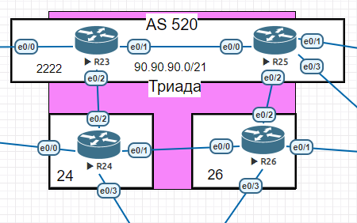

# ISIS 

###  Топология:

> IS-IS – протокол динамической маршрутизации для ISO CLNP, описанный в стандарте ISO 10589 и, впоследствии, доработанный (RFC 1195) для переноса префиксов IP в дополнение к CLNP.
    

### Цели:  Настроить IS-IS офисе Триада

1. [Настройка R23 и R25  в зоне 2222](#1)
2. [Настройка R24  в зоне 24](#2)
3. [Настройка R26  в зоне 26](#3)

Помним что по умолчанию маршрутизатор Cisco становится маршрутизатором уровня L1/L2

1. Настройка R23 и R25  в зоне 2222:

   * Включаем IS-IS на маршрутизатораах  tri-R23 и tri-R25 :

            tri-R23(config)#router  isis
            tri-R25(config)#router  isis

   * Настроика NET адреса для работы IS-IS:

            tri-R23(config-router)#net 49.2222.0023.0023.0023.00
            tri-R25(config-router)#net 49.2222.0025.0025.0025.00

   * Включаем IS-IS на интерфейсах.

            conf t 
              int eN/N
                ip router isis
            end 

2. Настройка R24  в зоне 24:

   * Настраиваем  аналогично  R25,R23  меняется только NET 

            net 49.0024.0024.0024.0024.00

2. Настройка R26  в зоне 26:

   * Настраиваем  аналогично  R25,R23,R24  меняется только NET 

            net 49.0026.0026.0026.0026.00

[вверх ](#top)
[конфиги ](/lab/ISIS/cfg) 