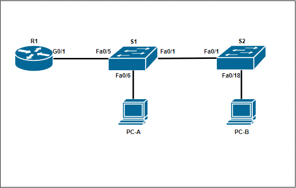

# VLAN и маршрутизация между VLAN.

###  Топология:



###  Таблица адресов:

| Device  | Interface  | IP Address  | Subnet Mask  |  Default Gateway |
| ------------ | ------------ | ------------ | ------------ | ------------ |
| R1 			   | G0/0/1.3    | 192.168.3.1| 255.255.255.0  |  N/A |
|   |  G0/0/1.4 |  192.168.4.1 | 255.255.255.0  | N/A  |
|   | G0/0/1.8  |  N/A  |  N/A  | N/A  |
|  S1 | VLAN 3  | 192.168.3.11  |  255.255.255.0 | 192.168.3.1   |
|  S2|  VLAN 3 | 192.168.3.12  | 255.255.255.0  | 192.168.3.1  |
|  PC-A | NIC  |  192.168.3.3 |255.255.255.0  | 192.168.3.1  |
|  PC-B |  NIC | 192.168.4.3   |  255.255.255.0 |192.168.4.1    |

###  Таблица VLAN:

| VLAN  | Name  |  Interface Assigned |
| ------------ | ------------ | ------------ |
| 3  |Management  | S1:VSI,Fa0/6 // S2:VSI  |
|  4 | Operations  | S2:  F0/18 |
|  7 | ParkingLot  |  S1: F0/2-4, F0/7-24, G0/1-2  // S2: F0/2-17, F0/19-24, G0/1-2 |
| 8  | Native  | N/A  |

### Цели:

  1. Создание сети и настройка базовых параметров на устройствах;
  2. Создать VLAN и назначить на порты коммутатора;
  3. Настройка Trunk порта между коммутаторами;
  4. Настройка маршрутизации между  VLAN на роутере;
  5. Убедиться что маршрутизация между VLAN работает;


###  Решение:
  1. Базовая  конфигурация  Роутера и  Коммутатора:
      * Для  начало настроим базовые настройки  на на наших устройствах  которые индентичны на R1,S1,S2. Я для удобства изначально записываю пул команд в  тесктовый  редактор после изменяя только hostname вставляю в CLI нашего устройсва
      
        ```
            enable
            configure terminal 
            hostname S2                     #Device name
            no ip domain-lookup             #Disable DNS lookup
            enable secret class             #Password a assignment to "enable"
            line console 0
            password cisco                  #Password a assignment to "console"
            login
            exit
            line vty 0 4                    #Password a assignment to "VTY"
            password cisco
            login
            exit
            service password-encryption     #Encrypt  password
            banner motd #                   #Create a banner
            This device is for authorized personnel only. 
            If you have not been provided with permission to 
            access this device - disconnect at once.
            #
            exit
            copy running-config startup-config
            clock set  15:14:00 06 march 2021
        ```
      
  2. Создание VLAN и назначения  портов:
        * Создаем  VLAN  на S1 и  S2 орентируясь на "Таблицу VLAN"

                configure terminal
                vlan 3
                name Management
                vlan 4
                name Operations
                vlan 7 
                name ParkingLot
                vlan  8
                name Native

        * Сосздадим VSI интерфейс в Management вилане для каждого коммутатора 

                S1(config)#interface vlan 3
                S1(config-if)#ip address 192.168.3.11 255.255.255.0
                S1(config-if)#no shutdown
                S1(config-if)#description  mngmt
                S1(config-if)#exit
                S1(config)#ip default-gateway 192.168.3.1

                S2(config)#interface vlan 3
                S2(config-if)#ip address 192.168.3.12 255.255.255.0
                S2(config-if)#no shutdown
                S2(config-if)#description  mngmt
                S2(config-if)#exit
                S2(config)#ip default-gateway 192.168.3.1

        * Назначим  все не использованые порты во VLAN ParkingLot 7

                S1(config)#interface  range fastEthernet0/2-4 , fastEthernet0/7-24
                S1(config-if-range)#shutdown 
                S1(config-if-range)#switchport mode access
                S1(config-if-range)#switchport access vlan 7    

                S2(config)#interface  range fastEthernet0/2-17, fastEthernet0/19-24
                S2(config-if-range)#shutdown 
                S2(config-if-range)#switchport mode access
                S2(config-if-range)#switchport access vlan 7

        * Назначим активные порты в актуальные VLAN использую "Таблицу VLAN"

                S2(config)#interface  fa0/18
                S2(config-if)#switchport mode access 
                S2(config-if)#switchport access vlan 4

                S1(config)#interface  fa0/6
                S1(config-if)#switchport mode access 
                S1(config-if)#switchport access vlan 3

        


  3. Настройка Trunk порта между коммутаторами:

        * Настройка Trunk порта, изменения native vlan и пропуск только конкретных vlan

                S1(config)#interface fa0/1
                S1(config-if)#switchport mode trunk
                S1(config-if)#switchport trunk native vlan 8
                S1(config-if)#switchport trunk allowed vlan 3,4,8
                S1(config-if)#description  to S2
                

                S1(config)#interface fa0/5
                S1(config-if)#switchport mode trunk
                S1(config-if)#switchport trunk native vlan 8
                S1(config-if)#switchport trunk allowed vlan 3,4,8
                S1(config-if)#description  to R1

                S2(config)#interface fa0/1
                S2(config-if)#switchport mode trunk
                S2(config-if)#switchport trunk native vlan 8
                S2(config-if)#switchport trunk allowed vlan 3,4,8
                S2(config-if)#description  to S1


  4. Настройка маршрутизации между  VLAN на роутере;

        * Настройка сабинтерфейсов на роутере.

                R1(config)#interface  gigabitEthernet0/0/1.3
                R1(config-subif)#encapsulation dot1Q 3
                R1(config-subif)#ip address 192.168.3.1 255.255.255.0
                R1(config)#interface gigabitEthernet0/0/1.4
                R1(config-subif)#encapsulation dot1Q 4
                R1(config-subif)#ip address 192.168.4.1 255.255.255.0
                R1(config)#interface  gigabitEthernet0/0/1.8

                R1#show ip interface  brief  | i up
                GigabitEthernet0/0/0   unassigned      YES unset  up                    down 
                GigabitEthernet0/0/1   unassigned      YES unset  up                    up 
                GigabitEthernet0/0/1.3 192.168.3.1     YES manual up                    up 
                GigabitEthernet0/0/1.4 192.168.4.1     YES manual up                    up 
                GigabitEthernet0/0/1.8 unassigned      YES unset  up                    up 

  5. Убедиться что маршрутизация между VLAN работает;

        * Пинг с PC-A до шлюза 
                
                Packet Tracer PC Command Line 1.0
                C:\>ping 192.168.3.1

                Pinging 192.168.3.1 with 32 bytes of data:

                Reply from 192.168.3.1: bytes=32 time<1ms TTL=255
                Reply from 192.168.3.1: bytes=32 time=1ms TTL=255
                Reply from 192.168.3.1: bytes=32 time<1ms TTL=255
                Reply from 192.168.3.1: bytes=32 time=1ms TTL=255

                Ping statistics for 192.168.3.1:
                    Packets: Sent = 4, Received = 4, Lost = 0 (0% loss),
                Approximate round trip times in milli-seconds:
                    Minimum = 0ms, Maximum = 1ms, Average = 0ms

                C:\>

        * Пинг с PC-A до PC-B


                C:\>ping 192.168.4.3

                Pinging 192.168.4.3 with 32 bytes of data:

                Reply from 192.168.4.3: bytes=32 time<1ms TTL=127
                Reply from 192.168.4.3: bytes=32 time=1ms TTL=127
                Reply from 192.168.4.3: bytes=32 time=21ms TTL=127
                Reply from 192.168.4.3: bytes=32 time=1ms TTL=127

                Ping statistics for 192.168.4.3:
                    Packets: Sent = 4, Received = 4, Lost = 0 (0% loss),
                Approximate round trip times in milli-seconds:
                    Minimum = 0ms, Maximum = 21ms, Average = 5ms

                C:\>
        
        * Пинг с PC-A до S2

                C:\>ping 192.168.3.12

                Pinging 192.168.3.12 with 32 bytes of data:

                Reply from 192.168.3.12: bytes=32 time<1ms TTL=255
                Reply from 192.168.3.12: bytes=32 time<1ms TTL=255
                Reply from 192.168.3.12: bytes=32 time<1ms TTL=255
                Reply from 192.168.3.12: bytes=32 time<1ms TTL=255

                Ping statistics for 192.168.3.12:
                    Packets: Sent = 4, Received = 4, Lost = 0 (0% loss),
                Approximate round trip times in milli-seconds:
                    Minimum = 0ms, Maximum = 0ms, Average = 0ms

        
        * Trcaert с PC-B до PC-A
        
                C:\>tracert
                Packet Tracer PC Tracert

                Usage: tracert target

                C:\>tracert 192.168.3.3

                Tracing route to 192.168.3.3 over a maximum of 30 hops: 

                1   0 ms      0 ms      1 ms      192.168.4.1
                2   1 ms      0 ms      1 ms      192.168.3.3

                Trace complete.

                C:\> 

        * Выводы с R1 

                R1#show arp 
                Protocol  Address          Age (min)  Hardware Addr   Type   Interface
                Internet  192.168.3.3             9   0004.9A85.B642  ARPA   GigabitEthernet0/0/1.3
                Internet  192.168.4.3             8   0060.479C.BE37  ARPA   GigabitEthernet0/0/1.4
                R1#

            