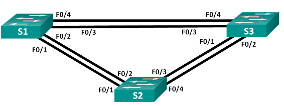

# Избыточность локальных сетей. STP. 

###  Топология:

###  Таблица адресации:

| Устройство  |  Интерфейс | IP-адрес  |  Маска подсети |
| ------------ | ------------ | ------------ | ------------ |
| S1  | VLAN 1  | 192.168.1.1 |  255.255.255.0  |
| S2   | VLAN 1  | 192.168.1.2  | 255.255.255.0  |
| S3  | VLAN 1  | 192.168.1.3  | 255.255.255.0  |

### Цели:

1. [Создание сети и настройка основных параметров устройства](#1)
2. [Выбор root'a](#2)
3. [Наблюдение за процессом выбора протоколом STP порта, исходя из стоимости портов](#3)
4. [Наблюдение за процессом выбора протоколом STP порта, исходя из приоритета портов](#4)

###  Решение:
  1. Настройка основных параметров устройства:
      * Отключение поиска DNS

            no ip domain-lookup 

      * Присвоение имен устройствам: 
            
            hostname S1  
            hostname S2
            hostname S3
      
      * Установим пароль class на enable: 

            enable secret class

      * Установим пароль на консоль и vty и запретим вывод каких-либо консольных сообщений: 

            line console  0
            password cisco
            logging synchronous

            line vty 0 4                   
            password cisco
            login

      * Настроим  баннер:
        
            banner motd #                   
            This device is for authorized personnel only. 
            If you have not been provided with permission to 
            access this device - disconnect at once.
            #

      * Настроим  VSI и сохраним  рабочую конфигурацию:

            interface vlan1
            ip address 192.168.1.1 255.255.255.0
            no shutdown

            interface vlan1
            ip address 192.168.1.2 255.255.255.0
            no shutdown

            interface vlan1
            ip address 192.168.1.3 255.255.255.0
            no shutdown

            copy running-config  startup-config 

      * Проверяем связанность: 
            
            S1#ping 192.168.1.2
            Type escape sequence to abort.
            Sending 5, 100-byte ICMP Echos to 192.168.1.2, timeout is 2 seconds:
            !!!!!
            Success rate is 100 percent (5/5), round-trip min/avg/max = 0/0/1 ms

            S1#ping 192.168.1.3
            Type escape sequence to abort.
            Sending 5, 100-byte ICMP Echos to 192.168.1.3, timeout is 2 seconds:
            !!!!!
            Success rate is 100 percent (5/5), round-trip min/avg/max = 0/0/0 ms

            S1#sh arp 
            Protocol  Address          Age (min)  Hardware Addr   Type   Interface
            Internet  192.168.1.1             -   0001.C9A8.858E  ARPA   Vlan1
            Internet  192.168.1.2             1   00E0.F75A.E34C  ARPA   Vlan1
            Internet  192.168.1.3             0   0001.4352.A0B8  ARPA   Vlan1
            S1#

  2. Определение root'a: 
     
        > Были  отключены все  интерфейсы,
        > настроены  подключённые порты в качестве trunk 
        > и включены F0/2 и F0/4 на всех коммутаторах

      * Выводы show spanning-tree: 

            S1#show spanning-tree 
            VLAN0001
            Spanning tree enabled protocol ieee
            Root ID    Priority    32769
                        Address     0001.4352.A0B8
                        Cost        19
                        Port        4(FastEthernet0/4)
                        Hello Time  2 sec  Max Age 20 sec  Forward Delay 15 sec

            Bridge ID  Priority    32769  (priority 32768 sys-id-ext 1)
                        Address     0001.C9A8.858E
                        Hello Time  2 sec  Max Age 20 sec  Forward Delay 15 sec
                        Aging Time  20

            Interface        Role Sts Cost      Prio.Nbr Type
            ---------------- ---- --- --------- -------- --------------------------------
            Fa0/2            Desg FWD 19        128.2    P2p
            Fa0/4            Root FWD 19        128.4    P2p

            
            S2#show spanning-tree 
            VLAN0001
            Spanning tree enabled protocol ieee
            Root ID    Priority    32769
                        Address     0001.4352.A0B8
                        Cost        19
                        Port        4(FastEthernet0/4)
                        Hello Time  2 sec  Max Age 20 sec  Forward Delay 15 sec

            Bridge ID  Priority    32769  (priority 32768 sys-id-ext 1)
                        Address     00E0.F75A.E34C
                        Hello Time  2 sec  Max Age 20 sec  Forward Delay 15 sec
                        Aging Time  20

            Interface        Role Sts Cost      Prio.Nbr Type
            ---------------- ---- --- --------- -------- --------------------------------
            Fa0/2            Altn BLK 19        128.2    P2p
            Fa0/4            Root FWD 19        128.4    P2p

            S3#show spanning-tree 
            VLAN0001
            Spanning tree enabled protocol ieee
            Root ID    Priority    32769
                        Address     0001.4352.A0B8
                        This bridge is the root
                        Hello Time  2 sec  Max Age 20 sec  Forward Delay 15 sec

            Bridge ID  Priority    32769  (priority 32768 sys-id-ext 1)
                        Address     0001.4352.A0B8
                        Hello Time  2 sec  Max Age 20 sec  Forward Delay 15 sec
                        Aging Time  20

            Interface        Role Sts Cost      Prio.Nbr Type
            ---------------- ---- --- --------- -------- --------------------------------
            Fa0/4            Desg FWD 19        128.4    P2p
            Fa0/2            Desg FWD 19        128.2    P2p

      * Роль и состояние активных портов на каждом коммутаторе:

        | S1  | S2  | S3  |
        | :------------: | :------------: | :------------: |
        | Fa0/2 Desg FWD  |Fa0/2 Altn BLK   | Fa0/2 Desg FWD |
        |  Fa0/4 Root FWD|  Fa0/4 Root FWD |Fa0/4 Desg FWD  |
      
      * Ответы  на вопросы:
            
        1. Какой коммутатор является корневым мостом? 
             > Коммутатор S3

        2. Почему этот коммутатор был выбран протоколом spanning-tree в качестве корневого моста?
            > Потому что коммутатор S3 имеет наименьший идентификатор BID

        3. Какие порты на коммутаторе являются корневыми портами?

            > На коммутаторе S3 нет root портов т.к это порт который имеет кратчайший путь к root  коммутатору, а как нам уже известно S3 и есть root 
        
        4. Какие порты на коммутаторе являются назначенными портами? 

            > На root коммутаторе все порты в роли designated  
        
        5. Какой порт отображается в качестве альтернативного и в настоящее время заблокирован?

            > S2 Fa0/2
        
        6. Почему протокол spanning-tree выбрал этот порт в качестве невыделенного (заблокированного) порта?

            > Наименьшие значение стоимости пути (со стороны  root  коммутатора  он составляет 19, а с S1 составляет 38 )
        

  3. Наблюдение за процессом выбора протоколом STP порта, исходя из стоимости портов:

        * В нашем случае  заблокированный порт находиться на  S2  и первое  что мы сделаем  изменим  стоимость root порта.

            > У меня PT  не  меняет стоимость порта  :(

  4. Наблюдение за процессом выбора протоколом STP порта, исходя из приоритета портов: 

        * Поднимаем порты F0/1 и F0/3 на всех коммутаторах    

              interface range fastEthernet0/1, fastEthernet0/3    
              no shutdown

        * Выводы show spanning-tree:

                  S1#show spanning-tree 
                  VLAN0001
                  Spanning tree enabled protocol ieee
                  Root ID    Priority    32769
                              Address     0001.4352.A0B8
                              Cost        19
                              Port        3(FastEthernet0/3)
                              Hello Time  2 sec  Max Age 20 sec  Forward Delay 15 sec

                  Bridge ID  Priority    32769  (priority 32768 sys-id-ext 1)
                              Address     0001.C9A8.858E
                              Hello Time  2 sec  Max Age 20 sec  Forward Delay 15 sec
                              Aging Time  20

                  Interface        Role Sts Cost      Prio.Nbr Type
                  ---------------- ---- --- --------- -------- -----------------------------
                  Fa0/1            Desg FWD 19        128.1    P2p
                  Fa0/2            Desg FWD 19        128.2    P2p
                  Fa0/3            Root FWD 19        128.3    P2p
                  Fa0/4            Altn BLK 19        128.4    P2p
             

                  S2#show spanning-tree 
                  VLAN0001
                  Spanning tree enabled protocol ieee
                  Root ID    Priority    32769
                              Address     0001.4352.A0B8
                              Cost        19
                              Port        3(FastEthernet0/3)
                              Hello Time  2 sec  Max Age 20 sec  Forward Delay 15 sec

                  Bridge ID  Priority    32769  (priority 32768 sys-id-ext 1)
                              Address     00E0.F75A.E34C
                              Hello Time  2 sec  Max Age 20 sec  Forward Delay 15 sec
                              Aging Time  20

                  Interface        Role Sts Cost      Prio.Nbr Type
                  ---------------- ---- --- --------- -------- -----------------------------
                  Fa0/2            Altn BLK 19        128.2    P2p
                  Fa0/1            Altn BLK 19        128.1    P2p
                  Fa0/3            Root FWD 19        128.3    P2p
                  Fa0/4            Altn BLK 19        128.4    P2p

                  S3#sh spanning-tree 
                  VLAN0001
                  Spanning tree enabled protocol ieee
                  Root ID    Priority    32769
                              Address     0001.4352.A0B8
                              This bridge is the root
                              Hello Time  2 sec  Max Age 20 sec  Forward Delay 15 sec

                  Bridge ID  Priority    32769  (priority 32768 sys-id-ext 1)
                              Address     0001.4352.A0B8
                              Hello Time  2 sec  Max Age 20 sec  Forward Delay 15 sec
                              Aging Time  20

                  Interface        Role Sts Cost      Prio.Nbr Type
                  ---------------- ---- --- --------- -------- -----------------------------
                  Fa0/4            Desg FWD 19        128.4    P2p
                  Fa0/3            Desg FWD 19        128.3    P2p
                  Fa0/2            Desg FWD 19        128.2    P2p
                  Fa0/1            Desg FWD 19        128.1    P2p

        * Ответы на вопросы:
            
            1. Какой порт выбран протоколом STP в качестве порта корневого моста на каждом коммутаторе некорневого моста? 
                  > S1 root port был Fa0/4 стал Fa03 

                  > S2 root port был Fa0/4 стал Fa03

            2. Почему протокол STP выбрал эти порты в качестве портов корневого моста на этих коммутаторах?
                  > Если  стоимость портов равна, смотрится BID. Если  же  и BID  равны то используются приоритеты портов  которые по умолчанию равны 128-ти. STP объединяет приоритет порта с номером порта. Наиболее низкие значения являются предпочтительными. 

                  > В нашем  случае   root  портами стали те которые имеют наименьший  приоритет (128.4 > 128.3)
      

      ------------

      [вверх ](#top)
      [конфиги ](/lab/L01/cfg) 
      
            
                     
