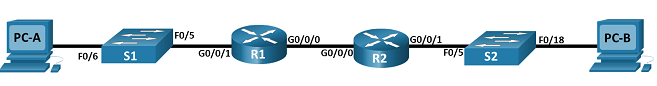

# DHCPv6 

###  Топология:

###  Таблица адресации:

|Device   |  Interface |  IPv6 Address |
| ------------ | ------------ | ------------ |
|R1   | G0/0/0  | 2001:db8:acad:2::1 /64  |
|   |   | fe80::1  |
|   |  G0/0/1 |  2001:db8:acad:1::1/64 |
|   |   | fe80::1  |
|  R2 |  G0/0/0 |  2001:db8:acad:2::2/64 |
|   |   |fe80::2   |
|   |  G0/0/1 |  2001:db8:acad:3::1 /64 |
|   |   | fe80::1  |
|  PC-A |  NIC |  DHCP |
|  PC-B  |  NIC |       DHCP    |

    

### Цели:

1. [Настройка основных параметров устройств](#1)
2. [Проверить назначенные адреса SLAAC от R1](#2)
3. [Настройка сервера DHCPv6 без отслеживания состояния](#3)
4. [Настройка сервера DHCPv6  с отслеживанием состояния ](#4)
5. [Настройка и проверка DHCPv6 Relay на R2](#5) 

###  Решение:
  1. Настройка основных параметров устройств:

       * Используем уже ранее готовый [файл](/lab/L02-DHCPv4/cfg/BasicDeviceSettings) с   командами для  базовой настройки, меняя значения на нужные

      * Включаем  маршрутизацию  IPv6 

                  R1(config)# ipv6 unicast-routing

                  R2(config)# ipv6 unicast-routing

      * Сохраняем  конфигурацию 
                  
                  R2#write
                  R1#write
      
      * Настройка  интерфейсов  G0/0/0 и G0/0/1  на R1 и R2  с адресами IPv6

                  R1(config)# interface g0/0/1
                  R1(config-if)# ipv6 address fe80::1 link-local
                  R1(config-if)# ipv6 address 2001:db8:acad:1::1/64
                  R1(config-if)# no shutdown
                  R1(config)# interface g0/0/0
                  R1(config-if)# ipv6 address fe80::1 link-local
                  R1(config-if)# ipv6 address 2001:db8:acad:2::1/64
                  R1(config-if)# no shutdown
      
                  R2(config)# interface g0/0/1
                  R2(config-if)# ipv6 address fe80::1 link-local
                  R2(config-if)# ipv6 address 2001:db8:acad:3::1/64
                  R1(config-if)# no shutdown
                  R1(config)# interface g0/0/0
                  R1(config-if)# ipv6 address fe80::2 link-local
                  R1(config-if)# ipv6 address 2001:db8:acad:2::2/64
                  R1(config-if)# no shutdown
      
      * Настройка  маршрута по умолчанию  для  обоих роутеров 

                  R1(config)# ipv6 route ::/0 2001:db8:acad:2::2

                  R2(config)# ipv6 route ::/0 2001:db8:acad:2::1
      
      * Проверяем  маршрутизацию  

                  R1#ping 2001:db8:acad:3::1 
                  Type escape sequence to abort.
                  Sending 5, 100-byte ICMP Echos to 2001:db8:acad:3::1, timeout is 2 seconds:
                  !!!!!
                  Success rate is 100 percent (5/5), round-trip min/avg/max = 0/0/0 ms

  2. Проверить назначенные адреса SLAAC от R1 

        *  Выводы  с  PC-A

                  C:\>ipconfig
                  FastEthernet0 Connection:(default port)
                  Connection-specific DNS Suffix..: 
                  Link-local IPv6 Address.........: FE80::205:5EFF:FE59:4643
                  IPv6 Address....................: 2001:DB8:ACAD:1:205:5EFF:FE59:4643
                  Autoconfiguration IPv4 Address..: 169.254.70.67
                  Subnet Mask.....................: 255.255.0.0
                  Default Gateway.................: FE80::1
                                                      0.0.0.0

  3. Настройка сервера DHCPv6 без отслеживания состояния 

        * Подробный вывод конфигурации   PC-А

                  C:\>ipconfig /all
                  FastEthernet0 Connection:(default port)
                  Connection-specific DNS Suffix..: 
                  Physical Address................: 0005.5E59.4643
                  Link-local IPv6 Address.........: FE80::205:5EFF:FE59:4643
                  IPv6 Address....................: 2001:DB8:ACAD:1:205:5EFF:FE59:4643
                  Autoconfiguration IP Address....: 169.254.70.67
                  Subnet Mask.....................: 255.255.0.0
                  Default Gateway.................: FE80::1
                                                      0.0.0.0
                  DHCP Servers....................: 0.0.0.0
        
        * Настройка R1 для предоставления DHCPv6 без сохранения состояния для PC-A 
        > Создаем пул DHCPv6 на R1
        
                  R1(config)# ipv6 dhcp pool R1-STATELESS
                  R1(config-dhcp)# dns-server 2001:db8:acad::254
                  R1(config-dhcp)# domain-name STATELESS.com

        > Настроить G0/0/1 на  R1 для  предоставления флага конфигурации LAN на R1
          
                  R1(config)# interface g0/0/1
                  R1(config-if)# ipv6 nd other-config-flag
                  R1(config-if)# ipv6 dhcp server R1-STATELESS

        * Подробный вывод конфигурации   PC-А после настройки 

                  C:\>ipconfig /all
                  FastEthernet0 Connection:(default port)
                  Connection-specific DNS Suffix..: STATELESS.com 
                  Physical Address................: 0005.5E59.4643
                  Link-local IPv6 Address.........: FE80::205:5EFF:FE59:4643
                  IPv6 Address....................: 2001:DB8:ACAD:1:205:5EFF:FE59:4643
                  Autoconfiguration IP Address....: 169.254.70.67
                  Subnet Mask.....................: 255.255.0.0
                  Default Gateway.................: FE80::1
                                                      0.0.0.0
                  DHCP Servers....................: 0.0.0.0
                  DHCPv6 IAID.....................: 1976607312
                  DHCPv6 Client DUID..............: 00-01-00-01-81-7E-60-DB-00-05-5E-59-46-43
                  DNS Servers.....................: 2001:DB8:ACAD::254
                                                      0.0.0.0
                 
        * Проверка   подключения. Пинг до интерфейса G0/0/1 на  R2

                  C:\> ping 2001:db8:acad:3::1
                  Pinging 2001:db8:acad:3::1 with 32 bytes of data:
                  Reply from 2001:DB8:ACAD:3::1: bytes=32 time=8ms TTL=254
                  Reply from 2001:DB8:ACAD:3::1: bytes=32 time<1ms TTL=254
                  Reply from 2001:DB8:ACAD:3::1: bytes=32 time<1ms TTL=254
                  Reply from 2001:DB8:ACAD:3::1: bytes=32 time<1ms TTL=254
                  Ping statistics for 2001:DB8:ACAD:3::1:
                  Packets: Sent = 4, Received = 4, Lost = 0 (0% loss),
                  Approximate round trip times in milli-seconds:
                  Minimum = 0ms, Maximum = 8ms, Average = 2ms

  

  4. Настройка сервера DHCPv6  с отслеживанием состояния 
        
        * Создаем пул DHCPv6 на  R1 

                  R1(config)# ipv6 dhcp pool R2-STATEFUL
                  R1(config-dhcp)# address prefix 2001:db8:acad:3:aaa::/80
                  R1(config-dhcp)# dns-server 2001:db8:acad::254
                  R1(config-dhcp)# domain-name STATEFUL.com
       
        * Назначаем созданный пул   для  интерфейса g0/0/0 на R1

                  R1(config)# interface g0/0/0
                  R1(config-if)# ipv6 dhcp server R2-STATEFUL

  5.  Настройка и проверка DHCPv6 Relay на R2 
      
        * Проверить на  PC-B получение SLAAC 

                  C:\>ipconfig /all 

                  FastEthernet0 Connection:(default port)
                  Connection-specific DNS Suffix..: 
                  Physical Address................: 0003.E415.A74C
                  Link-local IPv6 Address.........: FE80::203:E4FF:FE15:A74C
                  IPv6 Address....................: 2001:DB8:ACAD:3:203:E4FF:FE15:A74C
                  Autoconfiguration IP Address....: 169.254.167.76
                  Subnet Mask.....................: 255.255.0.0
                  Default Gateway.................: FE80::1
                                                      0.0.0.0
                  DHCP Servers....................: 0.0.0.0
                  DHCPv6 IAID.....................: 
                  DHCPv6 Client DUID..............: 00-01-00-01-C5-64-E6-25-00-03-E4-15-A7-4C
                  DNS Servers.....................: ::
                                                      0.0.0.0

        *  Настроить R2 в качестве DHCP-relay для G0/0/1  

                  R2(config)# interface g0/0/1
                  R2(config-if)# ipv6 nd managed-config-flag
                  R2(config-if)# ipv6 dhcp relay destination 2001:db8:acad:2::1 g0/0/0
            
        > ipv6 dhcp relay destination  не работает в  PT, но в  теории я понял что к чему(нет) и  буду переделывать и читать еще  несколько раз

        
      ------------

      [вверх ](#top)
      [конфиги ](/lab/L02-DHCPv6/cfg) 
      
            
                     
