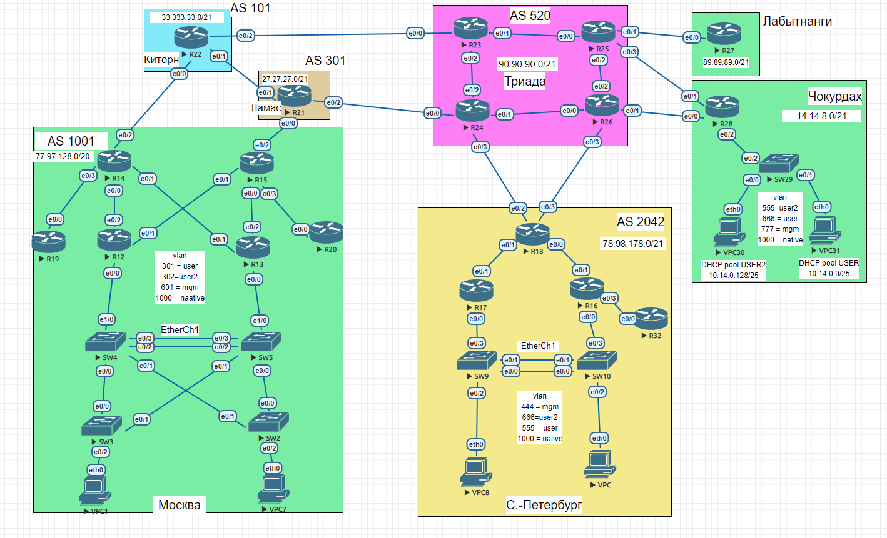

#  IPv4/v6

###  Пролог:
  
  >Из типовой схемы были убраны  линки до msk-R12/msk-R13 c SW5-SW5  в локации Санкт-Петербург  было проделано то же самое. 
  Убраны  по причине  того что мой разум решил  что линки максимально излишни  и  лучше сэкономить даллары. 
  Подсматривал у  mbfx, но полностью не списывал 

 > Подумав  я не нашел больше причин  кроме  того что линки максимально избыточны  и лично у меня  проблема настройки  hsrp/vrrp на множествах интерфейсах  одного роутера 
###  Задание:

  1. Разработать и задокументировать адресное пространство;
  2. Настроить IP адреса на каждом активном порту;
  3. Использовать IPv4 и IPv6;

###  Решение:

  1. [Задокументируем используемое адресное пространство с использованием IPv4 и IPv6;](#1)
     - [ Москва - AS1001 ](#1)
     - [ Санкт-Петербург - AS2042 ](#2)
     - [ Киторн - AS101 ](#3)
     - [ Ламас - AS301 ](#4)
     - [ Триада - AS520 ](#5) 
     - [ Лабытнанги](#6)
     - [ Чокурдах](#7)
  2. [Задокументируем выделенные для маршрутизаторов IP-адреса;](#Moscow)
  3. [Что по офисам ](#123)
  4. [Конфиг](cfg/)

###  1. Задокументируем используемое адресное пространство с использованием IPv4 и IPv6.

Адреса IPv4 будут, где это возможно, в последнем октете иметь цифру, совпадающую с номером маршрутизатора на схеме, например, для маршрутизатора R22 адрес будет иметь вид 77.97.128.22.

Адреса IPv6 будут, где это возможно, в последнем октете иметь цифру, совпадающую с номером маршрутизатора на схеме, например, для маршрутизатора R22 адрес будет иметь вид 20FF:CCFF:2000:1::22.

#### Москва - AS1001    

[выделенные для маршрутизаторов IP-адреса](#Moscow)

| Network IPv4     | Summary net    | Network IPv6             | Summary net         | Description       |
|-----------------:|:---------------|-------------------------:|:--------------------|-----------------|
| 77.97.128.0/24   | 77.97.128.0/20 | 20FF:CCFF:2000:1::/64    | 20FF:CCFF:2000::/48 | ####|
| 77.97.129.0/24   | 77.97.128.0/20 | 20FF:CCFF:2000:2::/64    | 20FF:CCFF:2000::/48 | ##### |
| 77.97.130.0/24   | 77.97.128.0/20 | 20FF:CCFF:2000:3::/64    | 20FF:CCFF:2000::/48 | ##### |
| 77.97.131.0/24   | 77.97.128.0/20 | 20FF:CCFF:2000:4::/64    | 20FF:CCFF:2000::/48 | ##### |
| 77.97.132.0/24   | 77.97.128.0/20 | 20FF:CCFF:2000:5::/64    | 20FF:CCFF:2000::/48 | ##### |
| 77.97.133.0/24   | 77.97.128.0/20 | 20FF:CCFF:2000:6::/64    | 20FF:CCFF:2000::/48 | ##### |

#### Санкт-Петербург - AS2042 

[выделенные для маршрутизаторов IP-адреса](#SPB)

| Network IPv4     | Summary net    | Network IPv6             | Summary net         | Description           |
|-----------------:|:---------------|-------------------------:|:--------------------|-----------------|
| 78.98.178.0/24   | 78.98.176.0/21 | 20FF:CCFF:200A:1::/64    | 20FF:CCFF:200A::/48 | ##### |
| 78.98.179.0/24   | 78.98.176.0/21 | 20FF:CCFF:200A:2::/64    | 20FF:CCFF:200A::/48 | ##### |
| 100.64.2.0/24    | 100.64.2.0/10  | 20FF:CCFF:2000:7::/64    | 20FF:CCFF:2000::/48 | MGM |

#### Киторн - AS101 

[выделенные для маршрутизаторов IP-адреса](#KIT)

| Network IPv4     | Summary net    | Network IPv6             | Summary net         | Description        |
|-----------------:|:---------------|-------------------------:|:--------------------|-----------------|
| 33.33.33.0/24   | 33.33.33.0/21 | 20FF:CCFF:200A:4::/64    | 20FF:CCFF:200A::/48 | ##### |
| 33.33.34.0/24   | 33.33.33.0/21 | 20FF:CCFF:200A:5::/64    | 20FF:CCFF:200A::/48 | ##### |
| 33.33.35.0/24   | 33.33.33.0/21 | 20FF:CCFF:200A:6::/64    | 20FF:CCFF:200A::/48 | ##### |

#### Ламас - AS301 

[выделенные для маршрутизаторов IP-адреса](#LAMA)

| Network IPv4     | Summary net    | Network IPv6             | Summary net         | Description        |
|-----------------:|:---------------|-------------------------:|:--------------------|-----------------|
| 27.27.25.0/24   | 27.27.27.0/21 | 20FF:CCFF:200A:7::/64    | 20FF:CCFF:200A::/48 | ##### |
| 27.27.26.0/24   | 27.27.27.0/21 | 20FF:CCFF:200A:8::/64    | 20FF:CCFF:200A::/48 | ##### |
| 27.27.27.0/24   | 27.27.27.0/21 | 20FF:CCFF:200A:9::/64    | 20FF:CCFF:200A::/48 | ##### |

#### Триада - AS520  

[выделенные для маршрутизаторов IP-адреса](#TRI)

| Network IPv4     | Summary net    | Network IPv6             | Summary net         | Description         |
|-----------------:|:---------------|-------------------------:|:--------------------|-----------------|
| 90.90.90.0/24   | 90.90.90.0/21 | 20FF:CCFF:200B:1::/64    | 20FF:CCFF:200B::/48 | ##### |
| 90.90.91.0/24   |90.90.90.0/21 | 20FF:CCFF:200B:2::/64    | 20FF:CCFF:200B::/48 | ##### |
| 90.90.92.0/24    | 90.90.90.0/21 | 20FF:CCFF:200B:3::/64    | 20FF:CCFF:200B::/48 | ##### |
| 90.90.93.0/24    | 90.90.90.0/21 | 20FF:CCFF:200B:4::/64    | 20FF:CCFF:200B::/48 | ##### |
| 90.90.94.0/24    | 90.90.90.0/21 | 20FF:CCFF:200B:5::/64    | 20FF:CCFF:200B::/48 | ##### |
| 90.90.95.0/24    | 90.90.90.0/21 | 20FF:CCFF:200B:6::/64    | 20FF:CCFF:200B::/48 | ##### |
| 90.90.88.0/24    | 90.90.90.0/21 | 20FF:CCFF:200B:7::/64    | 20FF:CCFF:200B::/48 | ##### | 
| 90.90.89.0/24    | 90.90.90.0/21 | 20FF:CCFF:200B:8::/64    | 20FF:CCFF:200B::/48 |    |

#### Лабытнанги 

[выделенные для маршрутизаторов IP-адреса](#LAB)

| Network IPv4     | Summary net    | Network IPv6             | Summary net         | Description         |
|-----------------:|:---------------|-------------------------:|:--------------------|-----------------|
| 89.89.89.0/24   | 89.89.89.0/21 | ipv6 address 20FF:CCFF:200C:1::27/64    | 20FF:CCFF:200B::/48 | ##### |

#### Чокурдах 

[выделенные для маршрутизаторов IP-адреса](#CHO)

| Network IPv4     | Summary net    | Network IPv6             | Summary net         | Description       |
|-----------------:|:---------------|-------------------------:|:--------------------|-----------------|
| 14.14.8.0/24   | 14.14.8.0/21 | 20FF:CCFF:200B:6  ::/64    | 20FF:CCFF:200B::/48 | ##### |
| 14.14.9.0/24   |14.14.8.0/21 | 20FF:CCFF:200B:7::/64    | 20FF:CCFF:200B::/48 | ##### |
| 14.14.10.0/24   |14.14.8.0/21 | 20FF:CCFF:200B:8::/64    | 20FF:CCFF:200B::/48 | ##### |
| 10.168.14.0/25 | 10.168.2.0/24 | 20FF:AAFF:2000:1::/64 | 20FF:AAFF:2000:::/64 | DHCP Users |
| 10.168.14.0/25 | 10.168.2.0/24 | 20FF:AAFF:2000:1::/64 | 20FF:AAFF:2000:::/64 | DHCP Users2 |
| 100.64.1.0/24    | 100.64.1.0/10  | 20FF:AAFF:2000:1::/64    | 20FF:AAFF:2000::/48 | MGM |

### 2. Задокументируем выделенные для маршрутизаторов IP-адреса;

Москва 

| Оборудование | Порт | v4/6 | Адрес          | Сеть                | Описание  |
|-------|------|---------|--------------------------|------------------------|-----------------|   
| msk-R12    | e0/1 | IPv4    | 77.97.132.12             | 77.97.132.0/24           | msk-R12 to msk-R15       |
| msk-R12    | e0/1 | IPv6    | 20FF:CCFF:2000:5::12/64  | 20FF:CCFF:2000::/48  | msk-R12 to msk-R15      |
| msk-R12    | e0/2 | IPv4    | 77.97.128.12             | 77.97.128.0/24           | msk-R12 to msk-R14       |
| msk-R12    | e0/2 | IPv6    | 20FF:CCFF:2000:1::12/64  | 20FF:CCFF:2000::/48 | msk-R12 to msk-R14        |
| msk-R13    | e0/1 | IPv4    | 77.97.130.13              | 77.97.130.0/24 | msk-R13 to msk-R14       |
| msk-R13    | e0/1 | IPv6    | 20FF:CCFF:2000:3::13/64  | 20FF:CCFF:2000:5:/48 | msk-R13 to msk-R14       |
| msk-R13    | e0/2 | IPv4    |  77.97.131.13             |  77.97.131.0/24 | msk-R13 to msk-R14       |
| msk-R13    | e0/2 | IPv6    | 20FF:CCFF:2000:4::13/64  | 20FF:CCFF:2000:4::/48 | msk-R13 to msk-R15 |
| msk-R14    | e0/0 | IPv4    |   77.97.128.14             |   77.97.128.0/24 | msk-R14 to msk-R12       |
| msk-R14    | e0/0 | IPv6    | 20FF:CCFF:2000:4::13/64  | 20FF:CCFF:2000:1::/48 | msk-R14 to msk-R12 |       
| msk-R14    | e0/1 | IPv4    |    77.97.130.14             |    77.97.130.0/24 | msk-R14 to msk-R13       |
| msk-R14    | e0/1 | IPv6    | 20FF:CCFF:2000:3::14/64  |  20FF:CCFF:2000:3::/48 | msk-R14 to msk-R13 | 
| msk-R14    | e0/2 | IPv4    |   77.97.128.14             |   33.33.33.0/24 | msk-R14 to kit-22       |
| msk-R14    | e0/2 | IPv6    | 20FF:CCFF:200A:4::14/64  | 20FF:CCFF:200A:4:: /48 | msk-R14 to kit-22 | 
| msk-R14    | e0/3 | IPv4    |   77.97.129.14             |    77.97.129.0/24 | msk-R14 to msk-R19       |
| msk-R14    | e0/3 | IPv6    | 20FF:CCFF:2000:2::14/64  |  20FF:CCFF:2000:2::/48 | msk-R14 to msk-R19 | 
| msk-R15    | e0/0 | IPv4    |   77.97.131.15             |   77.97.131.0/24 | msk-R15 to msk-R13       |
| msk-R15    | e0/0 | IPv6    | 20FF:CCFF:2000:4::15/64  |  20FF:CCFF:2000:4::/48 | msk-R15 to msk-R13 | 
| msk-R15    | e0/1 | IPv4    |   77.97.132.15             |    77.97.132.0/24 | msk-R15 to msk-R12       |
| msk-R15    | e0/1 | IPv6    | 20FF:CCFF:2000:5::15/64  |  20FF:CCFF:2000:5::/48 | msk-R15 to msk-R12 |
| msk-R15    | e0/2 | IPv4    |  27.27.25.15             |    27.27.25.0/24 | msk-R15 to lama-R21       |
| msk-R15    | e0/2 | IPv6    | 20FF:CCFF:200A:7::15/64  |  20FF:CCFF:200A:7::/48 | msk-R15 to lama-R21|
| msk-R15    | e0/3 | IPv4    |   77.97.133.15              |    77.97.133.0/24 | msk-R15 to msk-R20       |
| msk-R15    | e0/3 | IPv6    | 20FF:CCFF:2000:6::15/64  |  20FF:CCFF:2000:6::/48 | msk-R14 to msk-R20 |
| msk-R19    | e0/0 | IPv4    | 77.97.129.19            | 77.97.129.0/24           | msk-R12 to msk-R15       |
| msk-R19    | e0/0 | IPv6    | 20FF:CCFF:2000:2::19/64 | 20FF:CCFF:2000:2:/48  | msk-R12 to msk-R15      |
| msk-R20    | e0/0 | IPv4    | 77.97.133.20            | 77.97.133.20/24           | msk-R20 to msk-R15      |
| msk-R20    | e0/0 | IPv6    | 20FF:CCFF:2000:6::20/64  | 20FF:CCFF:2000:6::/48 | msk-R20 to msk-R15        |

------------

Киторн 

| Оборудование | Порт | v4/6 | Адрес          | Сеть                | описание  |
|-------|------|---------|--------------------------|------------------------|-----------------|
| kit-R22    | e0/0 | IPv4    | 33.33.33.22           | 33.33.33.0/24         | kit-R22 to msk-R14    |
| kit-R22    | e0/0 | IPv6    | 20FF:CCFF:200A:4::22/64  | 20FF:CCFF:200A:4::/48 | kit-R22 to msk-R14  |   
| kit-R22    | e0/1 | IPv4    | 33.33.34.22           | 33.33.34.0/24         | kit-R22 to  lama-R21    |
| kit-R22    | e0/1 | IPv6    | 20FF:CCFF:200A:5::22/64  | 20FF:CCFF:200A:5::/48 | kit-R22 to  lama-R21    |   
| kit-R22    | e0/2 | IPv4    | 33.33.35.22           | 33.33.35.0/24         | kit-R22 to   tri-R23  |
| kit-R22    | e0/2 | IPv6    | 20FF:CCFF:200A:6::22/64  |20FF:CCFF:200A:6::/48 | kit-R22 to  tri-R23   |   

------------

Ламас 

| Оборудование | Порт | v4/6 | Адрес          | Сеть                | описание  |
|-------|------|---------|--------------------------|------------------------|-----------------|
| lama-R21    | e0/0 | IPv4    | 27.27.25.21           | 27.27.25.0/24         | lama-R21 to msk-R15    |
| lama-R21    | e0/0 | IPv6    | 20FF:CCFF:200A:7::21/64   | 20FF:CCFF:200A:7::/48 | lama-R21 to msk-R15  |   
| lama-R21    | e0/1 | IPv4    | 33.33.34.21          | 33.33.34.0/24          | lama-R21 to kit-R22    |
| lama-R21    | e0/1 | IPv6    | 20FF:CCFF:200A:5::21/64   | 20FF:CCFF:200A:5::/48 | lama-R21 to kit-R22  | 
| lama-R21    | e0/2 | IPv4    | 27.27.27.21           | 27.27.27.0/24         | lama-R21 to tri-R24    |
| lama-R21    | e0/2 | IPv6    | 20FF:CCFF:200A:9::21/64   | 20FF:CCFF:200A:9::/48 | lama-R21 to tri-R24  | 

------------

Триада 

| Оборудование | Порт | v4/6 | Адрес          | Сеть                | описание  |
|-------|------|---------|--------------------------|------------------------|-----------------|
| tri-R24    | e0/0 | IPv4    | 27.27.27.24          | 27.27.27.0/24         | tri-R24  to lama-R21  |
| tri-R24   | e0/0 | IPv6    | 20FF:CCFF:200A:7::24/64   | 20FF:CCFF:200A:7::/48 | tri-R24  to lama-R21  |   
| tri-R24   | e0/1 | IPv4    | 90.90.91.24            | 90.90.88.0/24           | tri-R24  to tri-R26    |
| tri-R24    | e0/1 | IPv6    | 20FF:CCFF:200B:2::24/64  | 20FF:CCFF:200B:2::/48 | tri-R24  to tri-R26  | 
| tri-R24   | e0/2 | IPv4    | 90.90.90.24           | 90.90.88.0/24         |  tri-R24  to tri-R24  |
| tri-R24   | e0/2 | IPv6    | 20FF:CCFF:200B:1::24/64   | 20FF:CCFF:200B:1::/48 | tri-R24  to tri-R24   | 
| tri-R24   | e0/3 | IPv4    | 90.90.88.24/24      | 90.90.88.0/24         |  tri-R24  to tri-R18  | 
| tri-R24   | e0/3 | IPv6    |20FF:CCFF:200B:7::24/64     | 20FF:CCFF:200B:7::/48 | tri-R24  to tri-R18  |  
| tri-R23  | e0/0 | IPv4    | 33.33.35.23        | 33.33.35.0/24         | tri-R23 to lama-R21  |
| tri-R23   | e0/0 | IPv6    | 20FF:CCFF:200A:6::23/64   | 20FF:CCFF:200A:6::/48 | tri-R23 to lama-R21 |  
| tri-R23  | e0/1 | IPv4    | 90.90.90.23        | 90.90.88.0/24       | tri-R23 to tri-R25   |
| tri-R23   | e0/1| IPv6    |  20FF:CCFF:200B:3::23/64   |  20FF:CCFF:200B:3::/48 | tri-R23 to tri-R25   | 
| tri-R23  | e0/2 | IPv4    | 90.90.90.23          |90.90.88.0/24         | tri-R23 to tri-R24  |
| tri-R23   | e0/2 | IPv6    | 20FF:CCFF:200A:7::23/64   | 20FF:CCFF:200A:7::/48 | tri-R23 to tri-R24 |   
| tri-R26  | e0/0 | IPv4    | 90.90.91.26        | 90.90.88.0/24         | tri-R26   to tri-R24 |
| tri-R26   | e0/0 | IPv6    |  20FF:CCFF:200B:2::26/64 | 20FF:CCFF:200B:2::/48| tri-R26   to tri-R24 |  
| tri-R26  | e0/1 | IPv4    | 90.90.93.26   | 90.90.88.0/24     | tri-R26 to cho-R28    |
| tri-R26   | e0/1| IPv6    |  20FF:CCFF:200B:4::26/64   | 20FF:CCFF:200B:4::/48 | tri-R26 to cho-R28 | 
| tri-R26  | e0/2 | IPv4    | 90.90.94.26          | 90.90.88.0/24         | tri-R26  to tri-R25 |
| tri-R26   | e0/2 | IPv6    | 20FF:CCFF:200B:5::26/64  | 20FF:CCFF:200B::/48  | tri-R26  to tri-R25 |   
| tri-R26  | e0/3| IPv4    | 90.90.95.26      | 90.90.88.0/24       | tri-R26  to tri-R18  |
| tri-R26   | e0/3| IPv6    |  20FF:CCFF:200B:6::26/64    | 20FF:CCFF:200B::/48 | tri-R26  to tri-R18    | 
| tri-R25  | e0/0 | IPv4    | 90.90.90.25      | 90.90.88.0/24       | tri-R25 to tri-R23   |
| tri-R25   | e0/0| IPv6    |  20FF:CCFF:200B:3::25/64   |  20FF:CCFF:200B:3::/48 | tri-R25 to tri-R23   |  
| tri-R25    | e0/1 | IPv4    | 89.89.89.25          | 89.89.89.0/24         | tri-R25 to lab-R27    |
| tri-R25     | e0/1 | IPv6    |20FF:CCFF:200C:1::25/64   | 20FF:CCFF:200C:1::/48 | tri-R25 to lab-R27    | 
| tri-R25   | e0/2 | IPv4    | 90.90.90.25           | 90.90.88.0/24         |  tri-R25  to tri-R26  |
| tri-R25    | e0/2 | IPv6    | 20FF:CCFF:200B:1::25/64   | 20FF:CCFF:200B:1::/48 | tri-R25  to tri-R26   | 
| tri-R25    | e0/3 | IPv4    | 14.14.9.25          | 14.14.9.0/24         |  tri-R25  to cho-R28  |
| tri-R25    | e0/3 | IPv6    | 20FF:CCFF:200F:7::25/64     | 20FF:CCFF:200F:7::/48 | tri-R25  to cho-R28  | 

------------

Лабытнанги 

| Оборудование | Порт | v4/6 | Адрес          | Сеть                | описание  |
|-------|------|---------|--------------------------|------------------------|-----------------|
| lab-R27    | e0/0 | IPv4    | 89.89.89.27         | 89.89.89.0/24         | la-R27 to tri-R25   |
| lab-R27    | e0/0 | IPv6    | 20FF:CCFF:200C:1::27/64   | 20FF:CCFF:200C:27::/48 | la-R27 to tri-R25   |

------------

Чокурдах 

| Оборудование | Порт | v4/6 | Адрес          | Сеть                | описание  |
|-------|------|---------|--------------------------|------------------------|-----------------|
| cho-R28   | e0/0 | IPv4    | 14.14.8.28    | 14.14.8.0/24     | cho-R28 to tri-R26|
| cho-R28    | e0/0 | IPv6    | 20FF:CCFF:200F:6::28/64 | 20FF:CCFF:200F::/48 | cho-R28 to tri-R26  |
| cho-R28   | e0/2 | IPv4    | 14.14.9.28    | 14.14.8.0/24     | cho-R28 to tri-R25|
| cho-R28    | e0/1 | IPv6    | 20FF:CCFF:200F:7::28/64 | 20FF:CCFF:200F::/48 | cho-R28 to tri-R25  |

------------

Санкт-Петербург 

| Оборудование | Порт | v4/6 | Адрес          | Сеть                | описание  |
|-------|------|---------|--------------------------|------------------------|-----------------|
| spb-R32   | e0/0 | IPv4    | 78.98.178.32  | 78.98.178.0/24      | spb-R32   to spb-R16 |
| spb-R32      | e0/0 | IPv6    | 20FF:CCFF:200A:1::32/64 | 20FF:CCFF:200A:1::/48 |   to spb-R16 |
| spb-R16  | e0/3 | IPv4    | 78.98.178.16 | 78.98.178.0/24      | spb-R16   to  spb-R32  |
| spb-R16       | e0/3 | IPv6    | 20FF:CCFF:200A:1::16/64 | 20FF:CCFF:200A:1::/48 | spb-R16   to  spb-R32   |
| spb-R16  | e0/1 | IPv4    | 78.98.179.16 | 78.98.179.0/24      | spb-R16   to  spb-R18 |
| spb-R16       | e0/1 | IPv6    | 20FF:CCFF:200A:2::16/64   | 20FF:CCFF:200A::/48  | spb-R16   to  spb-R18  |
| spb-R17  | e0/1 | IPv4    | 78.98.180.17 | 78.98.180.0/24      | spb-R17  to  spb-R18 |
| spb-R17       | e0/1 | IPv6    | 20FF:CCFF:200A:3::17/64   | 20FF:CCFF:200A::/48  | spb-R17   to  spb-R18  |
| spb-R18    | e0/0 | IPv4    | 78.98.180.17 | 78.98.180.0/24      | spb-R18 to  spb-R16 |
| spb-R18        | e0/0 | IPv6    | 20FF:CCFF:200A:3::17/64   | 20FF:CCFF:200A::/48  | spb-R18    to  spb-R16 | 
| spb-R18    | e0/1 | IPv4    |78.98.179.18 | 78.98.179.0/24      | spb-R18  to  spb-R17 |
| spb-R18        | e0/1 | IPv6    | 20FF:CCFF:200A:2::18/64   | 20FF:CCFF:200A::/48  |spb-R18    to  spb-R17  |
| spb-R18 | e0/2 | IPv4    | 90.90.88.18/24      | 90.90.88.0/24         |  spb-R18 to tri-R24  | 
| spb-R18  | e0/2 | IPv6    |20FF:CCFF:200B:7::18/64     | 20FF:CCFF:200B:7::/48 | spb-R18  to tri-R24  |  
| spb-R18  | e0/3| IPv4    | 90.90.95.18      | 90.90.88.0/24       | spb-R18 to tri-R26    |
| spb-R18   | e0/3| IPv6    |  20FF:CCFF:200B:6::18/64    | 20FF:CCFF:200B::/48 | spb-R18 to tri-R26    | 

###  4. Что по офисам  ? 
 
В офисах у нас  будет разный   вилан   для каждого VPC    настроен только  DHCPv4 на  ротуре  по удобства  IPv6 для  траблшутинга  etc   

|Москва   | С-Петербург  | Чокурдах|  Описание | 
| ------------ | ------------ | ------------ |------------ |
| DHCPv4  | DHCPv4 | DHCPv4 | #### | 
| 10.77.0/25  | 10.78.0.0/25 | 10.14.0.0/25 | USER | 
| 10.77.0.128/25  | 10.78.0.128/25  | 10.14.0.128/25 | USER2 | 
| VLAN  | VLAN | VLAN | ### | 
| USER  301 | USER  555 | USER 666 | VPC| 
| USER2  302 | USER2  666 | USER2 555 | VPC | 
| MGM 601 | MGM 444 | MGM 777 |
------------

[top](#top)