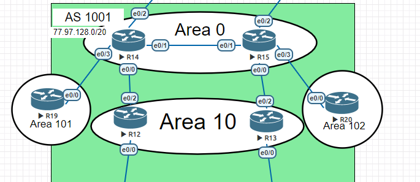

# OSPF 

###  Топология:

###  Таблица :

| area  |  equip |   des |   
| ------------ | ------------ | ------------ |
| 0  | R14  | backbone  |
|   |  R15 | backbone  | 
| 10  | R12   | normal  |
|   | R13  | normal  |    
| 101  | R19   |  totally stub |  
| 102 | R20  | normal  |   |  

    

### Цели:  Настроить OSPF офисе Москва Разделить сеть на зоны Настроить фильтрацию между зонами

1. [Настройка  R14-R15 они будут находиться в area 0 - backbone](#1)
2. [Настройка роутеров  R12-R13 в зоне 10. Дополнительно к маршрутам должны получать маршрут по-умолчанию](#2)
3. [Настройка роутера  R19  в зоне 101 и  он должен получать только маршрут по умолчанию](#3)
4. [Настройка  R20 в зоне 102 должен  получать все маршруты, кроме маршрутов до сетей зоны 101](#4)

router id для OSPF будет прописываться исходя из 10.77.0.n, где n номер роутера
для ospfv3 будет настройка идентичная меняем   только атрибуты ipv6 / ospf3

1. Настройка маршрутизаторов R14 и R15, area 0 - backbone:

   * Запускаем  процес  OSPF:

            msk-R14(config)#router   ospf  1
            msk-R15(config)#router   ospf  1

   * Назначаем  роутер id:

            msk-R14(config-router)#router-id 10.70.0.20
            msk-R15(config-router)#router-id 10.70.0.20

   * Теперь отключим отправку hello пакетов на всех интерфейсах.

            msk-R14(config-router)#passive-interface default
            msk-R15(config-router)#passive-interface default

   * Теперь укажем интерфейсы, на которых мы будем отправлять hello. 

        Для msk-R15 и msk-R14

            no passive-interface Ethernet0/0
            no passive-interface Ethernet0/1
            no passive-interface Ethernet0/3
    
   * Указываем на интерфейсе сеть которая будет участвовать в  OSPF в  нашем  случае  это е0/1 на msk-R15 и msk-R14 

            msk-R15(config-if)# ip ospf 1 area 0
            msk-R14(config-if)# ip ospf 1 area 0

2. Настройка роутеров  R12-R13 в зоне 10. Дополнительно к маршрутам должны получать маршрут по-умолчанию:

    Типовые  настройки  указаны  выше, так же настраиваем исходя из схемы, для того что бы  роутеры  получали  маршрут  по-умолчанию

   * На msk-R14 и msk-R15 прописываем: 

            default-information originate 
            

    
3. Настройка роутера  R19  в зоне 101 и  он должен получать только маршрут по умолчанию:ъ

   * Для того, чтобы зона 101 знала только маршрут по-умолчанию, нужно сделать её totally stub

            area 101  stub no-summary только на ABR

4. Настройка  R20 в зоне 102 должен  получать все маршруты, кроме маршрутов до сетей зоны 101:

   * Требуется фильтрация на  ABR для  зоны  102 является таким  msk-R15. Если прописано слово in, то маршрутизатор предотвращает попадание указанных сетей в область, номер которой мы укажем 
   

            msk-R15(config)#ip prefix-list filter-are102 deny  77.97.129.0/24
            msk-R15(config)#ip prefix-list filter-are102 permit 0.0.0.0/0 le 32
            msk-R15(config)#router ospf 1
            msk-R15(config-router)#area  102 filter-list prefix filter-are102 in
            msk-R15(config-router)#

[вверх ](#top)
[конфиги ](/lab/OSPF/cfg) 