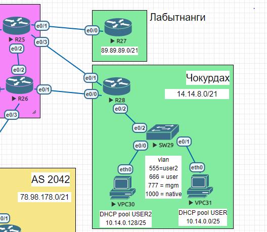

# PBR 

###  Схема:

### Цели:

1. [Настроить политику маршрутизации в офисе Чокурдах](#1)
2. [Распределить трафик между двумя линками с провайдером](#2)
3. [Настроить отслеживание линка через технологию IP SLA](#3)
4. [Настройть для офиса Лабытнанги маршрут по-умолчанию ](#4)
5. [Конфиг](cfg/)

###  Решение:
  1. Настроить политику маршрутизации в офисе Чокурдах:
    
      |  Eq  | Prot  |  Destination  |Gateway |M| Description|
      | ------------ | ------------| ------------ | ------------ |------------ |------------|
      |  cho-R28 |  IPv4  | 0.0.0.0/0  | 14.14.8.26 |1 | to tri-R26| 
      | cho-R28  | IPv6  | ::/0  | 20FF:CCFF:200F:6::26 | 1| to tri-R26| 
      |  cho-R28 |   IPv4|  0.0.0.0/0  | 14.14.9.25 | 1 | to tri-R25 |
      | cho-R28  | IPv6  | ::/0 |20FF:CCFF:200F:6::25 | 1| to tri-R25| 

      Настриваем  статические маршрут. Основной  линк  в  сторону  tri-R26 (14.14.8.26)

            cho-R28(config)# ip route 0.0.0.0 0.0.0.0 14.14.8.26 name to-tri-r26
            cho-R28(config)#ip route 0.0.0.0 0.0.0.0 14.14.9.25 10 name to-tri-r25
            cho-R28(config)# ipv6 route ::/0 20FF:CCFF:200F:7::25 10 name to-tri-r25
            cho-R28(config)# ipv6 route ::/0 20FF:CCFF:200F:6::26 name to-tri-R26
            

  2. Распределить трафик между двумя линками с провайдером
      
   > У нас  в офисе  имеются  два  VPC 30 и VPC 31  которые  находиться  в разных vlan. На данный  момент основным маршрутом  является  линк  в  сторону  tri-R26 (14.14.8.26) нам  потребовалось  что бы трафик  который  относятся к vlan 555 шел в сторону  tri-R25 (14.14.9.25 )
  
   > Настроим NAT  т.к  у нас  на роутере два outside интерфейса, будем настраивать  с помощью  route-map  

  * Настраиваем  внутренние  и внешние  интерфейсы 

        cho-R28#conf t
        cho-R28(config)# interface Ethernet0/2.555
        cho-R28(config-subif)# ip nat inside

        cho-R28(config-subif)# interface Ethernet0/2.666
        cho-R28(config-subif)# ip nat inside

        cho-R28(config-subif)# interface Ethernet0/0
        cho-R28(config-if)#  ip nat outside
        
        cho-R28(config)# interface Ethernet0/1
        cho-R28(config-if)#  ip nat outside
  
  * Настраиваем ACL для каждого VLAN 

        cho-R28(config)# ip access-list extended  VLAN555
        cho-R28(config-ext-nacl)# permit ip 10.14.0.128 0.0.0.127 any

        cho-R28(config)# ip access-list extended  VLAN555
        cho-R28(config-ext-nacl)# permit ip 10.14.0.128 0.0.0.127 any

  * Cоздаем  route-map

        cho-R28(config)# route-map NAT_TRIR26 permit 10
        cho-R28(config-route-map)# match ip address VLAN555 
        cho-R28(config-route-map)# match ip address VLAN666
        cho-R28(config-route-map)# match interface Ethernet0/0

        cho-R28(config)# route-map NAT_TRIR25 permit 10
        cho-R28(config-route-map)# match ip address VLAN555 
        cho-R28(config-route-map)# match ip address VLAN666
        cho-R28(config-route-map)# match interface Ethernet0/1

  * Задаем  что трафик из локалки  в первого или второго провайдера надо натить через e0/0 или e0/1

        cho-R28(config)# ip nat inside source route-map NAT_TRI25 interface Ethernet0/1 overload
        cho-R28(config)# ip nat inside source route-map NAT_TRIR26 interface Ethernet0/0 overload 
  
  * Теперь создаем  route-map  для  изменения  маршрута клиентов  с  vlan 555 

        cho-R28(config)# route-map VLAN555 permit 10
        cho-R28(config-route-map)# match ip address VLAN555
        cho-R28(config-route-map)# set ip next-hop 14.14.9.25

    > Теперь весь трафик  с клиентов  с  vlan 555 будет уходить в  сторону  tri-R25

  3. Настроить отслеживание линка через технологию IP SLA

  * Создаем IP SLA тест  (icmp-echo)

        cho-R28(config)#ip sla 1
        cho-R28(config-ip-sla)# icmp-echo 14.14.8.26 source-ip 14.14.8.28

  * Включаем IP SLA тест

        cho-R28(config)# ip sla schedule 1 life forever start-time now

  * Кроме  SLA  так же  требуется настроить track к которому прикрепляем  созданный SLA 

        cho-R28(config)# track  1 ip sla  1 reachability
  
  * Применяем трек на сам маршрут 

        cho-R28(config)#ip route 0.0.0.0  0.0.0.0 14.14.8.26 name tri-R26 track 1

  > Теперь после падения  линка  у нас будет меняться  маршрут 

  > На данный  момент все хорошо кроме  одного,  при падение  линка в   сторону tri-R25(14.14.9.25 )  у нас весь трафик  который  идет через этот канал попадает в дыру. Пробуем  исправить 

  * Создаем второй IP SLA тест  (icmp-echo)

        cho-R28(config)#ip sla 2
        cho-R28(config-ip-sla)# icmp-echo 14.14.9.25 source-ip 14.14.9.28
  
  * Включаем IP SLA тест

        cho-R28(config)# ip sla schedule 2 life forever start-time now

  * Привязываем track 

        cho-R28(config)# track  2 ip sla  2 reachability

  * Правим самую малость route-map 

        cho-R28(config)# route-map VLAN555 permit 10
        cho-R28(config-route-map)# set ip next-hop verify-availability 14.14.9.25 1 track 2
        cho-R28(config-route-map)# set ip next-hop 14.14.8.26

  >  Теперь в случае  недоступности  tri-R25 14.14.9.25 трафик  будет  идти по   основному каналу tri-R26 14.14.8.26

  4. Настройть для офиса Лабытнанги маршрут по-умолчанию 
        
      |  Eq  | Prot  |  Destination  |Gateway |M| Description|
      | ------------ | ------------| ------------ | ------------ |------------ |------------|
      |  lab-R27 |  IPv4  | 0.0.0.0/0  | 89.89.89.25 |1 | to tri-R25| 
      | lab-R27  | IPv6  | ::/0  | 20FF:CCFF:200F:6::26 | 1| to tri-R25| 

            lab-R27#conf t 
            lab-R27(config)#ip route  0.0.0.0 0.0.0.0 89.89.89.25 name to-tri-R25
            lab-R27(config)#ipv6  route ::/0 20FF:CCFF:200C:1::25

[top](#top)